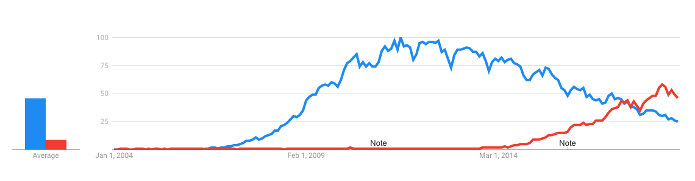

On December 19th, 2018 I completed the freeCodeCamp (FCC) curriculum to earn their  full stack certification. FCC estimates that this represents 1800 hours of coursework. The curriculum covers the full spectrum of web development basics and is a phenomenal way for new developers (like myself) to get into software development. In this post I'd like to briefly overview the curriculum, what I thought of it, and what I would have done differently.

## Curriculum Overview and Commentary

The FCC curriculum covers six modules: Responsive web design, Javascript algorithms and data structures, front-end libraries, data visualization, APIs & microservices, information security & quality assurance. The structure of each module is to go through many small exercises to introduce concepts and practice implementing basic code. Each module then ends with five projects that challenge you to implement the concepts you had just practiced into real-world, working projects. As any good student will recognize, these projects are where you will learn the most as you struggle to make your ideas work without structured guidance. To me this part is vital to the learning process and is part of what makes FCC so valuable.

The curriculum starts with responsive web design, which includes the full range of HTML and CSS, CSS flexbox, CSS grid, and responsive web design principles. When I got started with FCC I had very little idea of where to start, but I at least knew that I wanted to build cool, functional things, not just static websites (although that's cool too). So when FCC started with basic HTML and CSS I was slightly flustered and impatient. I especially struggled with translating lines of text into spatial-visual components. So if you're struggling with this aspect of software development, you are not alone.

The second module is Javascript algorithms and data structures, which includes basic JS, ES6, regular expressions, debugging, data structures, algorithms, object oriented programming, and functional programming. This section includes 21 intermediate level algorithm challenges, which I really enjoyed doing and gave me confidence to keep pushing forward. The final projects were similar to the intermediate challenges in this section and were equally challenging and fun.

Then front end libraries, which includes Boostrap, jQuery, Sass, ReactJS, and Redux. With this section you get a taste of the more exotic tools of web development. It makes you feel much cooler and more capable with your web development skills. When doing the projects for this section I focused almost entirely on React when building the projects. I did this because many people I talked to recommended I focus on learning React since it is a popular new framework for front-end development. You can see in the Google Trends chart below that React has exploded in popularity in the past few years, passing jQuery in interest. It has been a joy to work with so far, although I can't compare it to much else since I lack extensive personal experience at this point.

Red represents interest in React and blue represents interest in jQuery

Then data visualization, which focuses on D3JS, JSON, APIs and AJAX requests. This section is a great introduction to retrieving data from APIs using ajax requests. At first I couldn't see myself ever using D3 for data visualization after FCC. It didn't help that the documentation for D3 is not very strong. But after completing this section I am glad I know some basic data visualization techniques and the general structure of SVGs. I can easily see myself using D3 or other data visualization libraries in the near future to create cool data visualizations.

Then APIs and microservices, which includes the Node Package Manager, basic NodeJS, basic ExpressJS, MongoDB, and Mongoose. This section, and the next, really tied it all together for me. Up until this point I felt I had a gaping whole in my understanding of how web applications, and the web in general, worked. By learning to setup a basic server, a basic database, and API endpoints, I could finally see the whole picture of how modern web applications work.

Finally, information security and quality assurance, which includes HelmetJS, basic web security, hashing with bcrypt, unit and functional testing with Chai and Mocha, and advanced NodeJS, ExpressJS, MongoDB, and Mongoose. Finishing this section and its associated projects was the most fulfilling of all the modules because it brought together a lot of the FCC curriculum into several challenging web application projects that closely resemble real-world applications. For example, the last project, and for me the hardest, was to build an anonymous message board, similar to Reddit. Just a few weeks ago I would have been discouraged thinking about how to go about building a Reddit-like application, or even anything approaching the seemingly large complexity of something like Reddit. I can't be too hard on my past self because I had no database experience at that point. But now I can at least approach the mental challenges of thinking "well, how would I go about building this project I have in-mind?".

FCC estimates all of this to represent 1800 hours of coursework. I did not keep track of how many hours I worked on each section or on the entire ceritication, but I doubt it took 1800 hours. I started FCC at the end of July and finished by mid-December. Even if I had worked 10 hours per day for approximately 144 days it would total 1,440 hours. But I certainly did not work 10 hours per day for 144 days. In the case of the first few certifications I was working a demanding full-time job while completing these certifications, so my time spent on FCC was spread out over many weeks with only a few hours or less per day. After I quit my job I was focused almost entirely on FCC and coding, which shows in my completion timeline. I got the first certification on Sept 30 (63 days), then the second on Oct 16 (16 days), the third on Nov 24 (37 days), the fourth on Dec 4 (34 days), the fifth on Dec 10 (7 days), and the last on Dec 19 (10 days). That's a total of 144 days. In the first 75 days or so I was working full-time as a banker, with only a few hours each day to work on FCC. After mid-Oct I was almost working full-time on FCC for about 70 days. If I was working about 3 hours a day, on average, for 75 days, then for about 7 hours per day, on average, for 70 days, I would estimate I spent 715 hours total to complete FCC. The work got easier over time as I learned and retained more, which I suspect happens to anyone working through FCC and anyone learning a new skill.

## What I Would Have Done Differently

If I could go back to the beginning and do it all again I would have focused like a laser on FCC and nothing else. I got distracted with side projects while completing the curriculum. It was not at all bad for me to take time away from FCC to work on side projects. In fact, I learned a lot from doing mini, self-assigned work in-between FCC modules. But it was not as efficient as if I had focused on FCC all the way through to the end. This was because I would finish a section in FCC, feel confident that I knew the material, then attempt something that was too far beyond my reach at that point. I would then struggle for an unnecessarily long amount of time before completing the project or putting it aside and then returning to FCC.

Now that FCC is completed I can look back and realize that the struggles and frustration I felt when doing those side projects were covered in later FCC material. I would have saved a lot of time and frustration by trusting FCC instead of looking for more challenges.

## Conclusion

Overall I would highly recommend that anyone looking to become a software developer get started with FCC and stick with it until the end. At that point you will have great confidence in your ability to code up a project on your own and in your ability to learn new skills and expand your capabilities. Now get coding!

You can find my FCC certifications [here](https://spencercorwin.com/fcc-certifications/index.html) or see my code for the associated FCC projects [here](https://github.com/spencercorwin/free-code-camp). You can also return to the homepage of my personal website [here](https://spencercorwin.com) to see a list of links to the FCC projects.