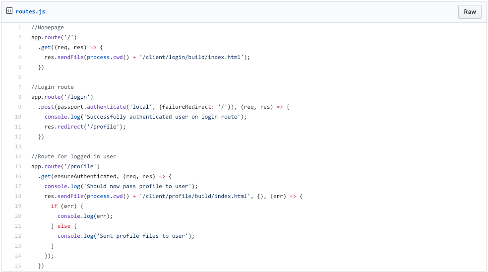
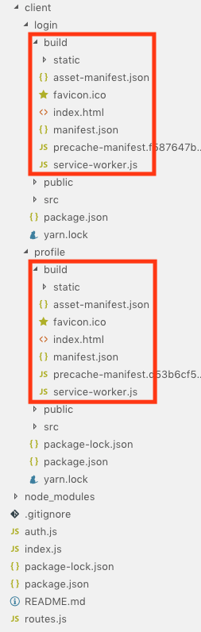
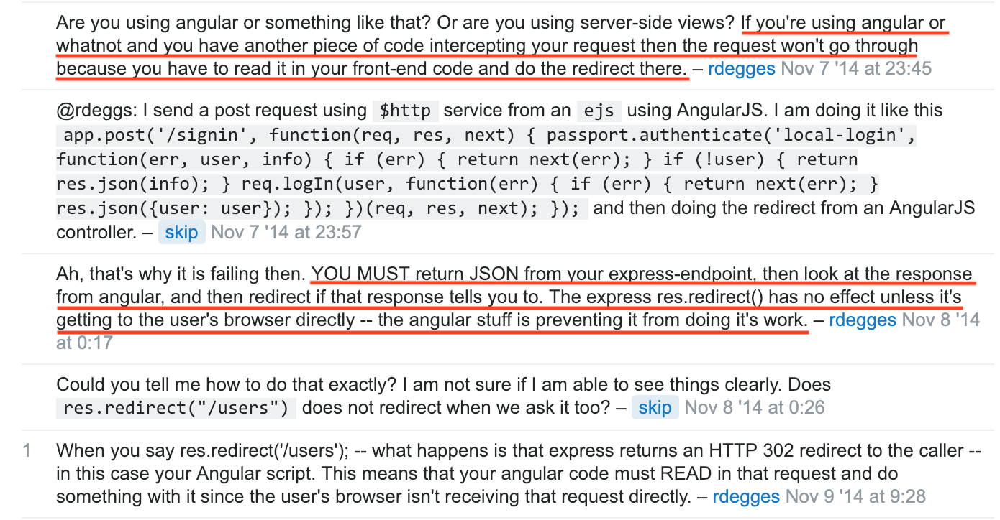
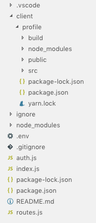

After at least a week of repeatedly banging my head against a wall I have finally, successfully connected my React front-end to my Express back-end. After finishing the Free Code Camp curriculum in mid-December I felt ready to finally build the apps of my dreams. My motto is, and always has been, to dream big but start small. So I swiftly got to work on my first independent, full-stack web-application, called Digidex. It's not currently completed but I've just made a large personal breakthrough by connecting the front-end to the back-end. This may not seem like a big deal to most people, and maybe it's truly not a big deal, but to me this was a major point of success for me. As I learned web-development I could not wrap my head around how the whole front-end/back-end dynamic worked. That was until I got to the very last lessons in Free Code Camp. Doing those back-end lessons and projects in Free Code Camp really opened up to my eyes to the larger picture of web development and allowed me to image the infinite possibilities and how I could create them. But Free Code Camp still glossed over how to combine the whole picture into fully-functioning web-apps. By getting this far in my first app, Digidex, I now feel I understand this dynamic much better.

## The Problem

Before this point I understood conceptually how front-end and back-ends work together, but not practically. My problem for many stressful hours was specifically how to do a redirect from Express with React. Free Code Camp never covered how to use a front-end framework like React with a back-end like Express. The examples that FCC used were with an Express back-end but a plain HTML front-end, or at most using Pug.js. Well I was set on using React, and I was interested in using React Router, which I had never used before. So I created the profile page for the authenticated user and the login page for authentication and for registration, all using React. Now the tricky part. How to use React Router to redirect from login page to profile page using my Express login API? I knew how to redirect from Express. But how was I supposed to use the Express redirect on the front-end with React Router? I worked on this for many hours, playing with React Router, reading tutorial snippets, and reading Router documentation. But I got nowhere. I eventually relented, abandoned React Router, and went with my backup plan- I would simply create two React apps (I figured I could always come back to React Router later). One app for the login page and another for the profile page. Express would send the user the login page on one route (with `response.sendFile()`) and then redirect to another Express route which would then serve the profile page.

Here's what the Express routes looked like (link to GitHub Gist [here](https://gist.github.com/spencercorwin/c81875106ea3954d711abbce4da52e50)):

Here's what the file structure of the two React apps looked like:

Maddeningly, this didn't work! Firing up the Express server I could see the login page render, and I could also see the profile page render on their respective Express routes. But when the login page hit the Express API for authentication, the Express redirect did nothing. Keep in mind that I only got this far after hours of frustration, trial and error, and many `console.log` 's. It was time to search the internet for the answer...

## The Solution

My main line of attack was to search something like "express won't send response after passport authentication redirect". From my view it looked like Express was doing everything except actually sending the `response.redirect('/profile')` back to the client. It's really at this point that I realize I don't know what I don't know. I can't quite ask the right question because I don't know the nature of the problem. I was just about to give-in and ask Stack Overflow when finally I find the nugget of knowledge that is the key to solving the problem at this [Stack Overflow question](https://stackoverflow.com/questions/26742079/passportjs-not-redirecting-after-user-is-authenticated).

Here's a photo of the Stack Overflow comment that tipped me off:

I learned that React has to handle the redirect. The browser won’t get redirect from Express directly. This is a key fact! I could now combine the two React apps into a single, easier to maintain app, and go back to React Router, which I have done and am still working on.

Here's the new file structure:

## What I Learned

When I realized I didn't know what I didn't know I also realized I would have saved many hours of frustration if I had a manager or mentor whom I could simply ask for direction. Personally, I like learning the "hard way", because you never forget what you learned when you learn this way. But learning on your own, without people to guide you and focus your energy, takes too much time and to me is not worth the tradeoff.