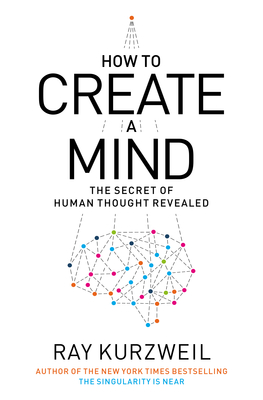
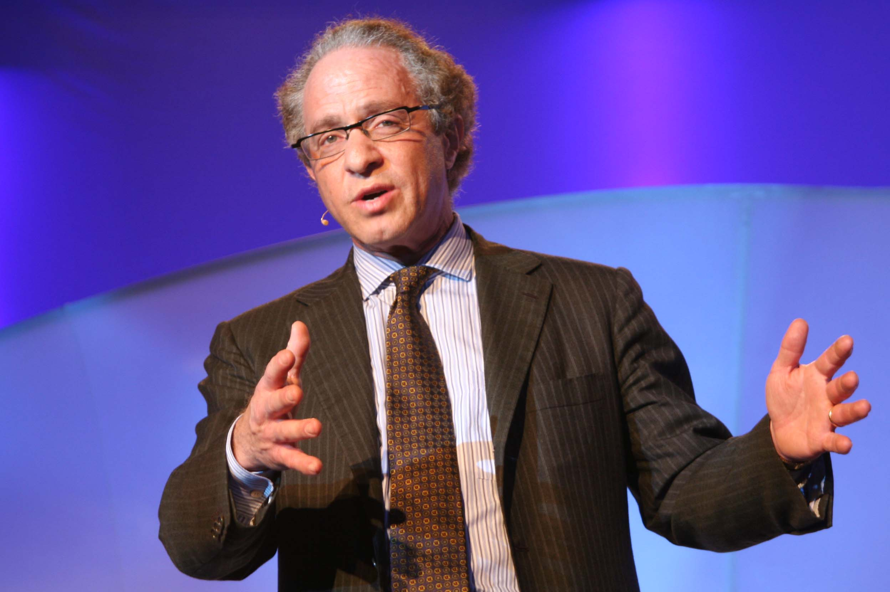
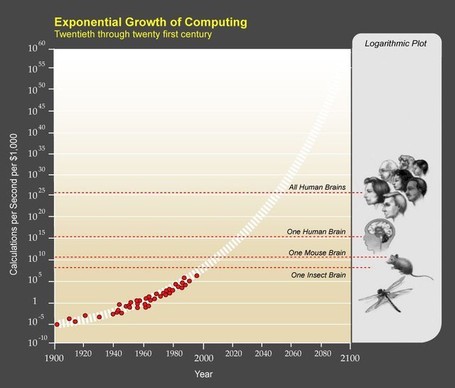
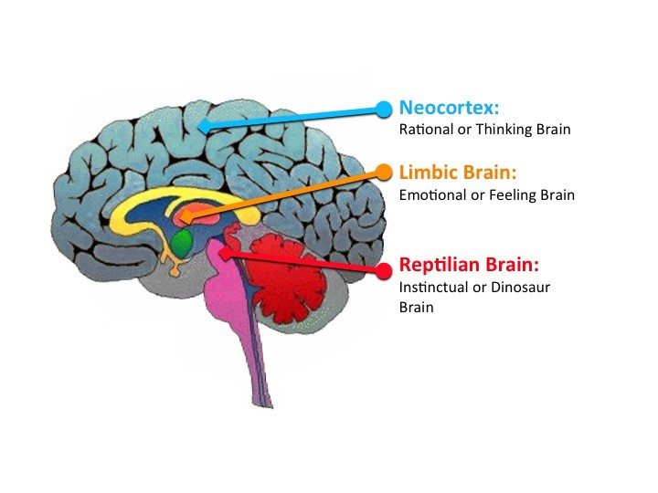
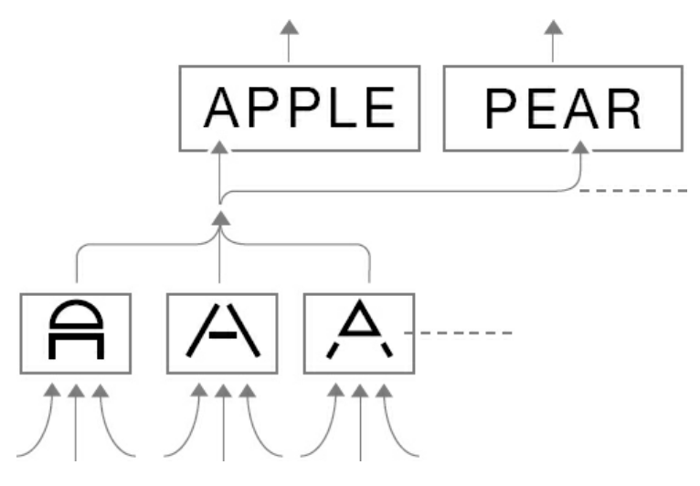
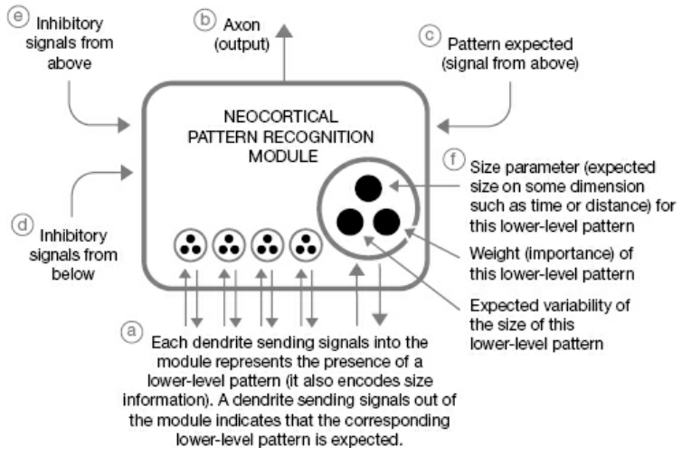
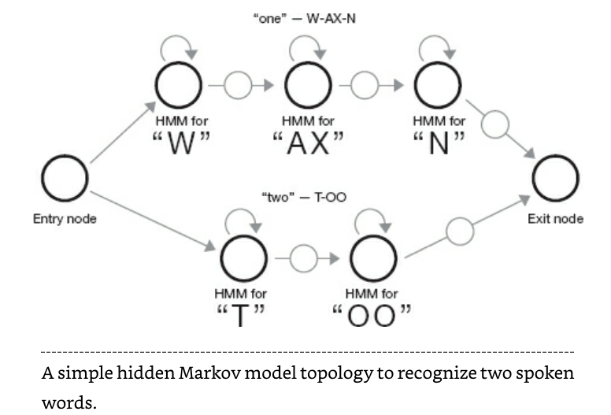
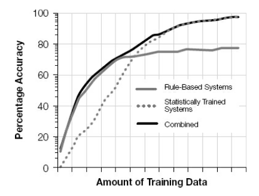

"A computer would deserve to be called intelligent if it could deceive a human into believing that it was human." — Alan Turing

In my first blog post I discussed why I decided to quit my job as a banker and become a software engineer. The primary reason was a shift in my thinking that was caused by Ray Kurzweil's latest book *How to Create a Mind*, which was published in 2012. I read this book in mid-2017 and it completed changed the way I saw the future. Before reading this book I was under the mistaken impression that the information technology ship had sailed. I thought it was essentially too late to get into the world of computers because by the time I would have "caught up" with the rest of the industry in terms of knowledge and skill it would be too late for me to make any real impact, so therefore there was little point in making such a transition. Computers were cool and all, but it was too late. I might as well try to find another way to make an impact. Reading *How to Create a Mind* shattered that way of thinking for me and opened my eyes to the infinite potential that still exists in information-based technologies (ie. computers and software). In this book Kurzweil specifically tackles the human brain, how it works, how we will succeed in reverse-engineering it, and how our understanding of it is enabling us to create artificial intelligence. As AI has has begun to enter the mainstream it appears that we are on the verge of an explosion of applications that utilize AI for awesome new applications. It is this new "revolution" that caught my attention and inspired me to enter the field of software.

## Ray Kurzweil and the Law of Accelerating Returns

Whenever I discuss my story with anyone I have to first ask if they've heard of Kurzweil and his ideas, because he is somewhat polarizing figure to anyone who is familiar with his work. He is famous for his many predictions of when certain technological benchmarks will be met. Nearly every one of his predictions sound impossibly rediculous at the time he makes them, yet many of them have come true. But before I get to Kurzweil's wildest predictions I should say that Kurzweil is not a professional theorist. He writes a lot of books and has spoken at many conferences, but his day job is as an inventor, entrepreneur, and Direct of Engineering at Google. It's easy to make predictions, but it's an entirely other thing to use your understanding of technological trends to succesfully invent and sell amazing products, which is what Kurzweil has done. The best example of this is a company started by Kurzweil called Kurzweil Computer Products, which he started in 1974 to develop the first optical character recognition system, which was then used for a text-to-speech synthesizer to allow blind people to understand written text by having a computer read it to them aloud. Eventually the company became Nuance Speech Technologies, which developed the technology that is now apart of iPhone's Siri.

In Kurzweil's first book, *The Age of Intelligent Machines*, written in the mid-190s, he predicted that a computer would take the world chess championship by 1998. IBM’s chess supercomputer Deep Blue famously defeated the reigning human world chess champion, Garry Kasparov in 1997, thereby fulfilling one of Kurzweil's most famous predictions. In *The Age of Intelligent Machines*, written in the mid-1980s, Kurzweil predicted the emergence in the mid - to late 1990s of a vast worldwide web of communications tying together people around the world to one another and to all human knowledge. Kurzweil has made many more predictions in past books and still has predictions outstanding, like his prediction that a computer will pass the Turing test by 2029. As Ray tells it in *How to Create a Mind*, "*The Age of Spiritual Machines* included hundreds of predictions for specific decades (2009 , 2019 , 2029 , and 2099). For example, I made 147 predictions for 2009 in The Age of Spiritual Machines, which I wrote in the 1990s. Of these, 115 (78 percent) are entirely correct as of the end of 2009; the predictions that were concerned with basic measurements of the capacity and price/performance of information technologies were particularly accurate. Another 12 (8 percent) are “essentially correct.” A total of 127 predictions (86 percent) are correct or essentially correct. (Since the predictions were made specific to a given decade, a prediction for 2009 was considered “essentially correct” if it came true in 2010 or 2011.) Another 17 (12 percent) are partially correct, and 3 (2 percent) are wrong."

Kurzweil's predictions are based on his theory called the Law of Accelerating Returns, which states that fundamental measures of information technology follow predictable and exponential trajectories. This concept is beyond the scope of this blog post, but can be pretty well explained visually with the chart below. The most dramatic example of the LOAR is the remarkably predictable exponential growth in the capacity and price/performance of information technologies. The evolutionary process of technology led invariably to the computer, which has in turn enabled a vast expansion of our knowledge base, permitting extensive links from one area of knowledge to another.

## The Pattern Recognition Theory of the Mind

*How to Create a Mind* seeks to understand precisely how the human brain works, and then to use those methods to create even more intelligent machines.

In his book, Kurzweil presents a thesis called the Pattern Recognition Theory of Mind (PRTM), which describes the basic algorithm of the neocortex (the region of the brain responsible for perception, memory, and critical thinking). Kurzweil uses his own thought experiments, as well as neuroscience research to create his PRTM.

Kurzweil argues that the neocortex is composed of a highly repetitive structure, allowing humans to create abitratily complex structures of ideas. We are capable of hierarchical thinking, of understanding a structure composed of diverse elements arranged in a pattern, representing that arrangement with a symbol, and then using that symbol as an element in a yet more elaborate configuration. This capability takes place in a brain structure called the neocortex, which in humans has achieved a threshold of sophistication and capacity such that we are able to call these patterns ideas. Through an unending recursive process we are capable of building ideas that are ever more complex.

The human neocortex contains about 300 million pattern recognizer modules, arranged in a hierarchy. For example, to recognize a written word there might be several pattern recognizers for each different letter stroke: diagonal, horizontal, vertical or curved. The output of these recognizers would feed into higher level pattern recognizers, which look for the pattern of strokes which form a letter. Finally a word-level recognizer uses the output of the letter recognizers. All the while signals feed both "forward" and "backward". For example, if a letter is obscured, but the remaining letters strongly indicate a certain word, the word-level recognizer might suggest to the letter-recognizer which letter to look for, and the letter-level would suggest which strokes to look for. This is a single sentence summarization of the pattern recognizer that Kurzweil discusses at length in his book.

## How To Create a Mind

So how would PRTM be repeated in computers? Kurzweil suggests that the best results will come from using hierarchical hidden Markov models and genetic algorithms, especially since he used all three successfully in his speech recognition work.

We would start with the pattern recognizer module. Make as many copies of the recognizer as we have memory and computational resources to support. Each recognizer computes the probability that its pattern has been recognized. In doing so, it takes into consideration the observed magnitude of each input (in some appropriate continuum) and matches these against the learned size and size variability parameters associated with each input. The recognizer triggers its simulated axon if that computed probability exceeds a threshold. This threshold and the parameters that control the computation of the pattern’s probability are among the parameters we will optimize with a genetic algorithm. Because it is not a requirement that every input be active for a pattern to be recognized, this provides for autoassociative recognition (that is, recognizing a pattern based on only part of the pattern being present). We also allow for inhibitory signals (signals that indicate that the pattern is less likely). Recognition of the pattern sends an active signal up the simulated axon of this pattern recognizer. This axon is in turn connected to one or more pattern recognizers at the next higher conceptual level. All of the pattern recognizers connected at the next higher conceptual level are accepting this pattern as one of its inputs. Each pattern recognizer also sends signals down to pattern recognizers at lower conceptual levels whenever most of a pattern has been recognized, indicating that the rest of the pattern is “expected.” Each pattern recognizer has one or more of these expected signal input channels. When an expected signal is received in this way, the threshold for recognition of this pattern recognizer is lowered (made easier). The pattern recognizers are responsible for wiring” themselves to other pattern recognizers up and down the conceptual hierarchy. Note that all the “wires" in a software implementation operate via virtual links (which are basically memory pointers) and not actual wires. This system is actually much more flexible than that in the biological brain. In a human brain, new patterns have to be assigned to an actual physical pattern recognizer, and new connections have to be made with an actual axon - to - dendrite link. Usually this means taking an existing physical connection that is approximately what is needed and then growing the necessary axon and dendrite extensions to complete the full connection.

To implement this approach to self - organizing hierarchical pattern recognition we should use hierarchical hidden Markov models. Note that not all hidden Markov model systems are fully hierarchical. To build a brain, we will want to enable our system to create as many new levels of hierarchy as needed. Also, most hidden Markov model systems are not fully self- organizing. A key requirement is to allow for the system to flexibly create its own topologies based on the patterns it is exposed to.

Our digital brain will also accommodate substantial redundancy of each pattern, especially ones that occur frequently. This allows for robust recognition of common patterns and is also one of the key methods to achieving invariant recognition of different forms of a pattern. We will, however, need rules for how much redundancy to permit, as we don’t want to use up excessive amounts of memory on very common low - level patterns.

The rules regarding redundancy, recognition thresholds, and the effect on the threshold of a “this pattern is expected” indication are a few examples of key overall parameters that affect the performance of this type of self - organizing system. We would initially set these parameters based on intuition, but we would then optimize them using a genetic algorithm.

A hierarchical pattern recognition system (digital or biological) will only learn about two— preferably one— hierarchical levels at a time. To bootstrap the system we would start with previously trained hierarchical networks that have already learned their lessons in recognizing human speech, printed characters, and natural - language structures. Such a system would be capable of reading natural-language documents but would only be able to master approximately one conceptual level at a time. Previously learned levels would provide a relatively stable basis to learn the next level. The system can read the same documents over and over, gaining new conceptual levels with each subsequent reading, similar to the way people reread and achieve a deeper understanding of texts.

We should also provide a critical thinking module, which would perform a continual background scan of all of the existing patterns, reviewing their compatibility with the other patterns (ideas) in this software neocortex. We have no such facility in our biological brains, which is why people can hold completely inconsistent thoughts with equanimity. Upon identifying an inconsistent idea, the digital module would begin a search for a resolution, including its own cortical structures as well as all of the vast literature available to it. A resolution might simply mean determining that one of the inconsistent ideas is simply incorrect (if contraindicated by a preponderance of conflicting data). More constructively, it would find an idea at a higher conceptual level that resolves the apparent contradiction by providing a perspective that explains each idea. The system would add this resolution as a new pattern and link to the ideas that initially triggered the search for the resolution. This critical thinking module would run as a continual background task.

We should also provide a module that identifies open questions in every discipline. As another continual background task, it would search for solutions to them in other disparate areas of knowledge. The knowledge in the neocortex consists of deeply nested patterns of patterns and is therefore entirely metaphorical. We can use one pattern to provide a solution or insight in an apparently disconnected field using these metaphors.

We should provide a means of stepping through multiple lists simultaneously to provide the equivalent of structured thought. A list might be the statement of the constraints that a solution to a problem must satisfy. Each step can generate a recursive search through the existing hierarchy of ideas or a search through available literature. We will also want to enhance our artificial brains with the kind of intelligence that computers have always excelled in, which is the ability to master vast databases accurately and implement known algorithms quickly and efficiently. Finally, any new brain will need a purpose, a series of goals, to set it in the right direction.

The brain is extremely slow but massively parallel. Today’s digital circuits are at least 10 million times faster than the brain’s electrochemical switches. Conversely, all 300 million of the brain’s neocortical pattern recognizers process simultaneously, and all quadrillion of its interneuronal connections are potentially computing at the same time. The key issue for providing the requisite hardware to successfully model a human brain, though, is the overall memory and computational throughput required. We do not need to directly copy the brain’s architecture, which would be a very inefficient and inflexible approach.

Our new digital brain can be expanded in ways that a human biological brain cannot. Once a digital neocortex learns a skill, it can transfer that know-how in minutes or even seconds. When we augment our own neocortex with a synthetic version, we won’t have to worry about how much additional neocortex can physically fit into our bodies and brains, as most of it will be in the cloud, like most of the computing we use today. As soon as we start thinking in the cloud, there will be no natural limits— we will be able to use billions or trillions of pattern recognizers, basically whatever we need, and whatever the law of accelerating returns can provide at each point in time. Last but not least, we will be able to back up the digital portion of our intelligence.

As I hope I've summarized in this blog post, combining human-level pattern recognition with the inherent speed and accuracy of computers will result in very powerful abilities and a very bright future indeed, which is what got me so excited in the first place and has lead me to this point in my life.
