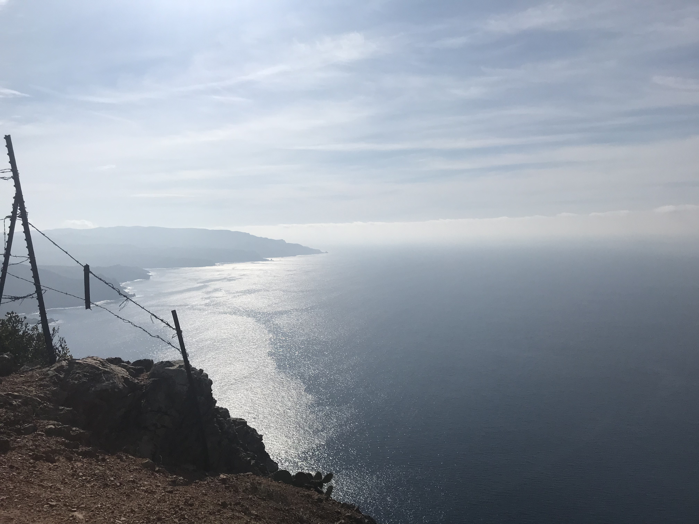
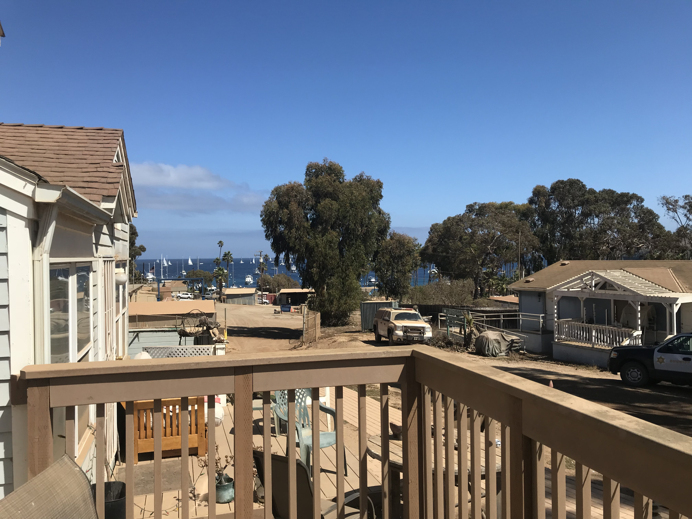
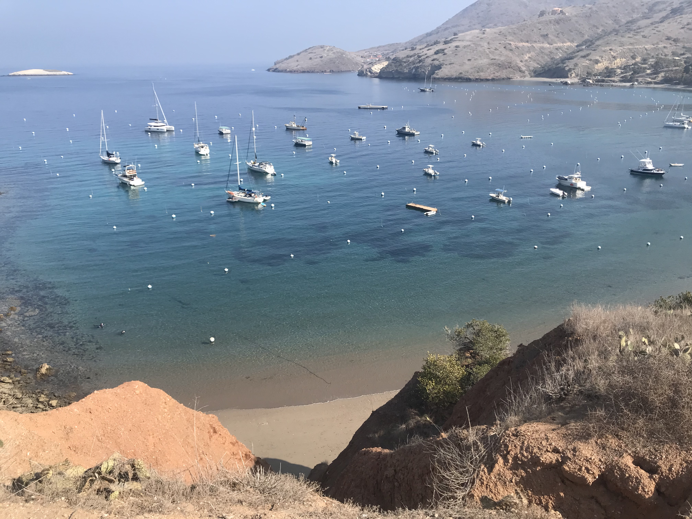

I'm living the island life. Not the Hawaiian Island life. The Santa Catalina Island life. Catalina Island is an island off the coast of southern California. It is about 22 miles long and 8 miles wide at its widest point. It has only one official city, Avalon, with a population of about 3,500. Avalon is a somewhat popular spot for mainlanders to go on a weekend get-away. Otherwise there's not much else on the island. The only other population center on the island to speak of is Two Harbors, with an approximate population of about 150 people.

Two Harbors, that small town in the distance, is where I currently live and study. In a previous post I described [how I quit my job as a banker to learn to code](../how-i-quit-my-job/how-i-quit-my-job.md). Obviously many people won't have the option of quitting their job to code full-time, but if you can then it's a huge advantage. One of the biggest, most overlooked advantages, is the ability to focus on a single thing. It's actually not all that hard to come home after work and start coding, assuming you have the right mindset and you don't have other responsibilities like a spouse, kids, or even pets. But even in that ideal scenario you have to split your energy and focus on your day job and your coding. Inevitably thoughts from your day job bleed into your afterwork thoughts of coding. You're sitting there trying to do nothing but focus on code and all of a sudden you're thinking about the way your boss said something to a co-worker. It's just not possible to make a distinct cutoff between work and code after 5PM. Not to mention all the other distractions that come at you: you need to get gas, pay the bills, get groceries, settle an issue with your roommates, get some exercise, see your friends, call you parents, and on and on. This obviously was my reality until recently. The way I solved this problem was to literally move to a remote island.

Frankly I like the quiet isolation of the island. There is so much less to worry about, leaving so much more time for coding, reading, and writing. Not to mention I'm on an island which is quite beautiful, as you can tell by the photos.

There are always distractions, no matter where you are or what you're doing. But an effective strategy for combating these distractions is to simply get rid of them or make them more difficult for you to access. For example, if you live in New York City with all your best friends it's going be very difficult to choose to sit in a room quietly by yourself learning to code over going out with your friends. But if you're a bit further away, physically, from your friends and fun times, then it becomes just a bit easier to decide between distraction and coding. You can take that attitude as far as you can by simply removing certain activities from your life that are unnecessary, even if it's temporary. For example, maybe you think you watch too much television. You could simply unplug the TV and move it into the garage. You can still watch TV whenever you want to, but you've made it a bit more difficult for yourself. If you wanted to watch TV it's no longer a single step of turning it on, but at least a three step process of lugging it out of the garage, setting it up, and then turning it on. This is a simplified example but this kind of thinking is a very effective way of getting back more time and energy to focus on your coding.

I've practiced this all throughout my life and it has given me a huge advantage over my own inclinations to procrastinate. And the good news is that this attitude and focus on what you should be doing gets easier over time as you practice it. Today I'm on an island that I can get off of any day I want. I just have to get on a boat for 90 minutes and accept some sea sickness to get to the mainland and the world of endless distraction. It would be so much easier and more fulfilling though to stay on the island and code. Which is what I plan on doing until I accomplish my goal of becoming a professional software developer. For me, the only real way off the island is success.

