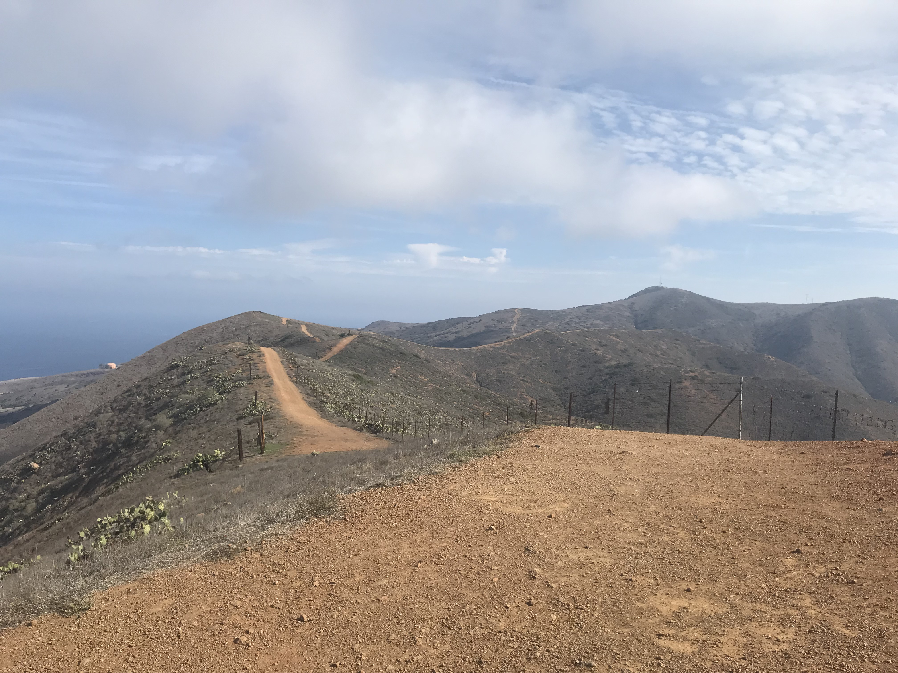

I'm living the island life. No, not the Hawaiian Island life. The Santa Catalina Island life. It's much different. Catalina Island is about 22 miles long and 8 miles wide at its widest point. It has only one official city, Avalon, with a population of about 3,500. Avalon is a somewhat popular spot for mainlanders to go on a weekend get-away. Otherwise there's not much . The only other population center on the island to speak of is Two Harbors, with an approximate population of about 150 people. Two Harbors is where I currently live and study. You likely wouldn't be aware of Catalina Island unless you were from southern California or you looked it up after hearing about the "F*****g Catalina Wine Mixer" in the movie Step Brothers.

There is no escape. The only escape is success.

